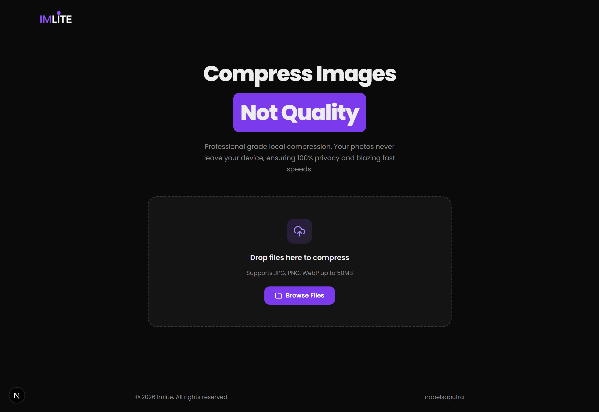
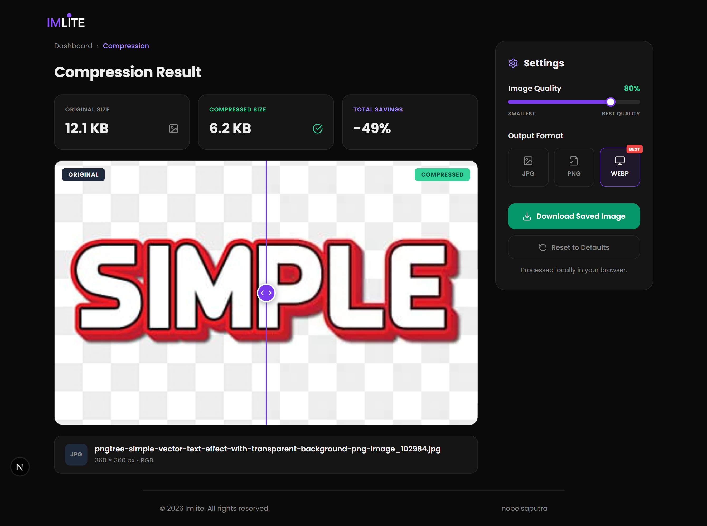

<div align="center">

# Imlite - Compress Image

**A fast, client-side image compression web app. No upload to server. No privacy risk. Just compress and go.**

[]() [ ](https://imlite.vercel.app)

🔗 **[Live Demo](https://imlite.vercel.app)** · [Portfolio](https://nobelsaputra.vercel.app)

</div>

---

## Preview





---

## About This Project

just simple compress image without delete the QUALITY

---

## Features

- **Drag & Drop** — Upload images as easily as drag and drop
- **Client-side Processing** — No files are ever sent to the server
- **Quality Control** — Adjust compression levels to suit your needs
- **Batch Compress** — Kompres banyak gambar sekaligus
- **Before/After Preview** — Compare size and quality before downloading
- **Format Support** — JPG, PNG, WebP
- **Responsive** — Fully optimized for both desktop and mobile

---

## Tech Stack

- **Next Js**
- **Tailwindcss**

---

## Run Locally

```bash
# Clone repo
git clone https://github.com/nobel-saputra/imlite.git
cd imlite

# Install dependencies
npm install

# Start dev server
npm run dev

```

Follow the provided server instructions to complete the setup. :)

---

## Project Structure

```
imlite/
├── app/
│   ├── compress/         # Compression page logic
│   ├── css/              # Global styles
│   ├── layout/           # Shared components (Navbar, Footer)
│   ├── lib/              # Utility functions and libraries
│   ├── layout.tsx        # Main layout
│   └── page.tsx          # Landing page
├── public/               # Static assets (images, icons)
├── package.json          # Project configuration
└── tsconfig.json         # TypeScript configuration
```

---

## License

MIT License — email me if you want use this project nobelsaputra10@gmail.com

---

<div align="center"> Built by <a href="https://github.com/nobel-saputra">nobelsaputra</a>  </div>
